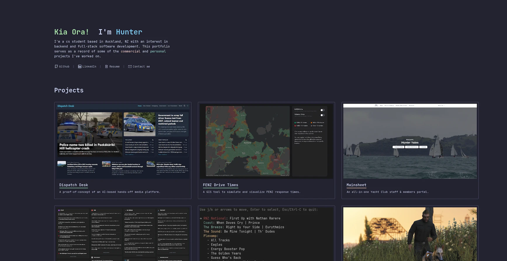

# Portfolio

My personal portfolio website, designed to showcase some of the projects I have worked on.
[hunteryates.nz](https://hunteryates.nz/)

## Why
I wanted the ability to demonstrate and display some of the projects I have worked on. I also wanted the ability to write about, and share my thoughts on some of the projects I am most proud of.